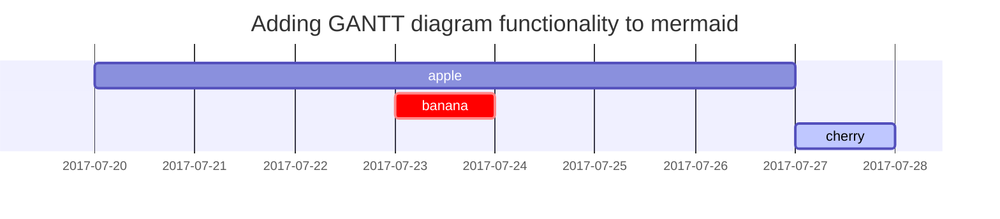

本教程将指导您如何在 *Chirpy* 模板中撰写文章，即使您以前使用过 Jekyll，也值得阅读，因为许多功能需要特殊的设置。

## 文件名与路径 #

创建一个名为 `YYYY-MM-DD-TITLE.md`的文件，并将其放在根目录的 `_posts`中 如果您想节省创建文件的时间，请考虑使用插件 [`Jekyll-Compose`](https://github.com/jekyll/jekyll-compose) 来实现此目的。

## 前置文本

你需要在文章顶部填写如下的 [Front Matter](https://jekyllrb.com/docs/front-matter/)：

```yaml
---
title: 标题
description: Examples of text, typography, math equations, diagrams, flowcharts, pictures, videos, and more. # 描述
author: zhangdk # 作者名称 _config.yml 中配置了就不要填
pin: true # 是否置顶文章
date: 2024-09-29 14:10:00 +0800 # GitHub Pages 部署不要填，会根据md文件的时间生成创建时间，git的commit会覆盖md文件，自动生成创建时间和last mod date
categories: [主分类, 子分类]
tags: [标签]     # TAG 名称应始终为小写，但实测好像不需要
image: # 预览图
  path: /path/to/image
  alt: 图片描述文本
---
```

> 帖子的 *layout* 已默认设置为 `post`，因此无需在 Front Matter 中再添加变量 *layout*。
>
> 正常配置下只需要如下填写 Front Matter
>
> {: .prompt-tip }

```yaml
---
title: 如何写一篇新Post
description: >-
  如何写一篇新Post
categories: [博客, 教程]
tags: [Jekyll, Chirpy]
---
```

### 时区与日期

为了准确记录文章的发布日期，您不仅应该设置 `_config.yml` 的 `timezone`，还应该在 `前置文本` 的 `date` 变量中提供文章的时区。格式：`+/-TTTT`，例如 `+0800`。

### 类别与标签

每个帖子的`categories`最多包含两个元素，`tags`中的元素数量可以是零到无穷大。例如：

```yaml
---
categories: [Animal, Insect]
tags: [bee]
---
```

### 作者信息

文章的作者信息通常不需要填写在 *Front Matter* 中，它们会默认从变量 `social.name` 和配置文件的 `social.links` 第一个条目中获取。但你也可以按如下方式覆盖它：

在 `_data/authors.yml` 中添加作者信息（如果您的网站没有此文件，请毫不犹豫地创建一个）。

```yaml
<author_id>:
  name: <full name>
  twitter: <twitter_of_author>
  url: <homepage_of_author>
```
{: file="_data/authors.yml" }

然后使用`author`指定单个作者或使用`authors`指定多个作者：

```yaml
---
author: <author_id>                     # for single entry
# or
authors: [<author1_id>, <author2_id>]   # for multiple entries
---
```

话虽如此，值`author`也可以识别多个条目。

> 从文件 `_data/authors.yml` 中读取作者信息的好处是，页面会带有元标记 `twitter:creator`，丰富了 [Twitter Cards](https://developer.twitter.com/en/docs/twitter-for-websites/cards/guides/getting-started#card-and-content-attribution)，有利于搜索引擎优化。
{: .prompt-info }

### 文章概述

默认情况下，文章的第一段话会显示在帖子列表的主页上、*Further Reading* 部分以及 RSS 源的 XML 中。如果您不想显示帖子的自动生成描述，可以使用_Front Matter_ 中的`description`字段对其进行自定义，如下所示：

```yaml
---
description: Short summary of the post.
---
```

此外，`description` 文本也将显示在帖子页面的帖子标题下。

### 目录

默认情况下，目录（TOC）显示在帖子的右侧面板上。如果要全局关闭，请在 `_config.yml` 并将变量 `toc` 的值设置为 `false`。如果要关闭特定帖子的目录，请在帖子的 [Front Matter](https://jekyllrb.com/docs/front-matter/) 中添加以下内容：

```yaml
---
toc: false
---
```

### 置顶文章

您可以将一个或多个帖子固定在主页顶部，固定帖子根据其发布日期以相反的顺序排序。通过以下方式启用：

```yaml
---
pin: true
---
```

### 评论区

评论的全局开关由文件 `_config.yml` 中的变量 `comments.active` 定义。为该变量选择评论系统后，将为所有帖子打开评论。

如果您想关闭特定帖子的评论，请在帖子的 **Front Matter** 中添加以下内容：

```yaml
---
comments: false
---
```

## 媒体资源

在 *Chirpy* 中，我们将图像、音频和视频称为媒体资源（Media）。

### URL 前缀

有时我们必须为帖子中的多个资源定义重复的URL前缀，这是一项无聊的任务，您可以通过设置两个参数来避免。

- 如果您使用CDN来托管媒体文件，您可以在`_config. yml`{：.filepath}中指定`CDN`。网站头像和帖子的媒体资源URL随后以CDN域名为前缀。

  ```yaml
  cdn: https://cdn.com
  ```
  {: file='_config.yml' .nolineno }

- 要指定当前帖子/页面范围的资源路径前缀，在当前文章的 *front matter* 中设置`media_subpath`:

  ```yaml
  ---
  media_subpath: /path/to/media/
  ---
  ```
  {: .nolineno }

选项`site. cdn`和`page.media_subpath`可以单独或组合使用，以灵活地组合最终资源URL：`[site.cdn/][page.media_subpath/]file.ext`

### 图片

#### 图片描述

将斜体文本添加到图像的下一行，然后它将成为图片描述并出现在图像的底部：

```markdown

_Image Caption_
```
{: .nolineno}

#### 大小

为了防止加载图像时页面内容布局发生移动，我们应该为每个图像设置宽度和高度。

```markdown
{: width="700" height="400" }
```
{: .nolineno}

> 对于SVG，您必须至少指定其 *width* (宽度)，否则将无法显示。
{: .prompt-info }

从 *Chirpy v5.0.0* 开始， `height` 与 `width` 支持缩写 (`height` → `h`, `width` → `w`). 以下示例与上述效果相同：

```markdown
{: w="700" h="400" }
```
{: .nolineno}

#### 位置

默认情况下，图像居中，但您可以使用其中一个类来指定位置 `normal`, `left`, and `right`.

> 指定位置后，不应添加图片描述。
{: .prompt-warning }

- **左对齐**

  图像将在下面的示例中保持左对齐：

  ```markdown
  {: .normal }
  ```
  {: .nolineno}

- **浮在左侧**

  ```markdown
  {: .left }
  ```
  {: .nolineno}

- **浮在右侧**

  ```markdown
  {: .right }
  ```
  {: .nolineno}

#### 深色/亮色模式

您可以在深色/亮色模式下使图像遵循主题偏好。这需要您准备两张图像，一张用于暗模式，一张用于亮模式，然后为它们分配一个特定的类 (`dark` or `light`):

```markdown
{: .light }
{: .dark }
```

#### 阴影

程序窗口的截图可以考虑显示阴影效果：

```markdown
{: .shadow }
```
{: .nolineno}

#### 预览图

如果您想在帖子顶部添加图像，请提供分辨率为 `1200 x 630`. 请注意，如果图像长宽比不符合 `1.91 : 1`，图像将被缩放和裁剪。

了解这些先决条件后，您可以开始设置图像的属性：

```yaml
---
image:
  path: /path/to/image
  alt: image alternative text
---
```

注意 [`URL前缀`] 也可以传递给文章头图，设置好后，属性 `path` 只需要图像文件名。

为了简单使用，您也可以只使用 `image` 定义路径。

```yml
---
image: /path/to/image
---
```

#### LQIP

对于预览图像：

```yaml
---
image:
  lqip: /path/to/lqip-file # or base64 URI
---
```

> 您可以在这篇帖子的预览图像中查看LQIP的使用 "[Text and Typography](https://github.com/cotes2020/jekyll-theme-chirpy/blob/master/_posts/2019-08-08-text-and-typography.md?plain=1)".

对于一般图像：

```markdown
{: lqip="/path/to/lqip-file" }
```
{: .nolineno }

### 视频

#### 社交媒体平台

您可以使用以下语法嵌入来自社交媒体平台的视频：

```

```

`Platform` 是平台名，`ID`为视频ID。

下表显示了如何在给定的视频URL中获取我们需要的两个参数，您还可以了解当前支持的视频平台。

| Video URL                                                                                          | Platform   | ID             |
| -------------------------------------------------------------------------------------------------- | ---------- | :------------- |
| [https://www.**youtube**.com/watch?v=**H-B46URT4mg**](https://www.youtube.com/watch?v=H-B46URT4mg) | `youtube`  | `H-B46URT4mg`  |
| [https://www.**twitch**.tv/videos/**1634779211**](https://www.twitch.tv/videos/1634779211)         | `twitch`   | `1634779211`   |
| [https://www.**bilibili**.com/video/**BV1Q44y1B7Wf**](https://www.bilibili.com/video/BV1Q44y1B7Wf) | `bilibili` | `BV1Q44y1B7Wf` |

##### 示例：

```

```

#### 视频文件

如果要直接嵌入视频文件，请使用以下语法：

```

```

其中`URL`是视频文件的URL，例如。 `/path/to/sample/video.mp4`.

您还可以为嵌入的视频文件指定其他属性。这是允许的属性的完整列表。

- `poster='/path/to/poster.png'` — 下载视频时显示的视频的海报图像
- `title='Text'` — 出现在视频下方且看起来与图像相同的视频的标题
- `autoplay=true` — 视频会尽快自动开始播放
- `loop=true` — 到达视频结尾时自动返回开始
- `muted=true` — 音频最初将被静音
- `types` — 指定以`|`分隔的其他视频格式的扩展名。确保这些文件与您的主视频文件位于同一目录中。

一个使用上述所有内容的示例：

```

```

### 音频

如果要直接嵌入音频文件，请使用以下语法：

```

```

Where `URL` is a URL to an audio file e.g. `/path/to/audio.mp3`.

您还可以为嵌入的音频文件指定其他属性。这是允许的属性的完整列表。

- `title='Text'` — 出现在音频下方且看起来与图像相同的音频的标题
- `types` — 指定以`|`分隔的其他音频格式的扩展名。确保这些文件与您的主音频文件位于同一目录中。

考虑一个使用上述所有内容的示例：

```

```

## 数学公式

我们使用[**MathJax**][mathjax]生成数学公式。出于网站性能原因，默认情况下不会加载数学功能。但它可以通过以下方式启用：

```yaml
---
math: true
---
```

启用数学公式后，您可以使用以下语法添加数学方程：

- **Block math** should be added with `$$ math $$` with **mandatory** blank lines before and after `$$`
  - **Inserting equation numbering** should be added with `$$\begin{equation} math \end{equation}$$`
  - **Referencing equation numbering** should be done with `\label{eq:label_name}` in the equation block and `\eqref{eq:label_name}` inline with text (see example below)
- **Inline math** (in lines) should be added with `$$ math $$` without any blank line before or after `$$`
- **Inline math** (in lists) should be added with `\$$ math $$`

```markdown
<!-- Block math, keep all blank lines -->

$$
LaTeX_math_expression
$$

<!-- Equation numbering, keep all blank lines  -->

$$
\begin{equation}
  LaTeX_math_expression
  \label{eq:label_name}
\end{equation}
$$

Can be referenced as \eqref{eq:label_name}.

<!-- Inline math in lines, NO blank lines -->

"Lorem ipsum dolor sit amet, $$ LaTeX_math_expression $$ consectetur adipiscing elit."

<!-- Inline math in lists, escape the first `$` -->

1. \$$ LaTeX_math_expression $$
2. \$$ LaTeX_math_expression $$
3. \$$ LaTeX_math_expression $$
```

> 从`v7.0.0`开始，**MathJax**的配置选项已移至文件 `assets/js/data/mathjax.js`，您可以根据需要更改选项，例如添加 [extensions][mathjaxexts].
> 如果您通过以下方式构建网站 `chirpy-starter`，将该文件从gem安装目录（使用命令`bundle info--path jekyll-they-chirpy`检查）复制到存储库中的同一目录。
{: .prompt-tip }

## Mermaid

[**Mermaid**](https://github.com/mermaid-js/mermaid) 是一个很棒的图表生成工具。要在您的帖子中启用它，请将以下内容添加到YAML块中：

```yaml
---
mermaid: true
---
```

然后你可以像其他 `Markdown` 语言一样使用它：
\````mermaid`
\`````


## 标题

示例，仅H2、H3标题会被添加至目录。

<!-- markdownlint-capture -->
<!-- markdownlint-disable -->

# H1 — heading

{: .mt-4 .mb-0 }

## H2 — heading

{: data-toc-skip='' .mt-4 .mb-0 }

### H3 — heading

{: data-toc-skip='' .mt-4 .mb-0 }

#### H4 — heading

{: data-toc-skip='' .mt-4 }
<!-- markdownlint-restore -->

## 正文

Quisque egestas convallis ipsum, ut sollicitudin risus tincidunt a. Maecenas interdum malesuada egestas. Duis consectetur porta risus, sit amet vulputate urna facilisis ac. Phasellus semper dui non purus ultrices sodales. Aliquam ante lorem, ornare a feugiat ac, finibus nec mauris. Vivamus ut tristique nisi. Sed vel leo vulputate, efficitur risus non, posuere mi. Nullam tincidunt bibendum rutrum. Proin commodo ornare sapien. Vivamus interdum diam sed sapien blandit, sit amet aliquam risus mattis. Nullam arcu turpis, mollis quis laoreet at, placerat id nibh. Suspendisse venenatis eros eros.

### 列表

#### 有序列表

1. 第一
2. 第二
3. 第三

```
1. 第一
2. 第二
3. 第三
```

#### 无序列表

- Chapter
  - Section
    - Paragraph
- 第一

```
- Chapter
  - Section
    - Paragraph
* 第一
```

#### ToDo 列表

- 任务

  - 步骤 1
  - 步骤 2
  - 步骤 3

```
- [ ] 任务
  - [x] 步骤 1
  - [x] 步骤 2
  - [ ] 步骤 3
```

#### 描述列表

Sun
: the star around which the earth orbits

Moon
: the natural satellite of the earth, visible by reflected light from the sun

### 引用块

> 本行展示引用块

### 提示文本

There are several types of prompts: `tip`, `info`, `warning`, and `danger`. They can be generated by adding the class `prompt-{type}` to the blockquote. For example, define a prompt of type `info` as follows:

```md
> Example line for prompt.
{: .prompt-info }
```

{: .nolineno }

<!-- markdownlint-capture -->
<!-- markdownlint-disable -->

> An example showing the `tip` type prompt.
{: .prompt-tip }

> An example showing the `info` type prompt.
{: .prompt-info }

> An example showing the `warning` type prompt.
{: .prompt-warning }

> An example showing the `danger` type prompt.
{: .prompt-danger }
> <!-- markdownlint-restore -->

```
> 提示文本.
> An example showing the `提示` type prompt.
{: .prompt-tip }

> An example showing the `信息` type prompt.
{: .prompt-info }

> An example showing the `警告` type prompt.
{: .prompt-warning }

> An example showing the `危险` type prompt.
{: .prompt-danger }
```

### 表格

| Company                      | Contact          | Country |
| :--------------------------- | :--------------- | ------: |
| Alfreds Futterkiste          | Maria Anders     | Germany |
| Island Trading               | Helen Bennett    |      UK |
| Magazzini Alimentari Riuniti | Giovanni Rovelli |   Italy |

```
| Company                      | Contact          | Country |
| :--------------------------- | :--------------- | ------: |
| Alfreds Futterkiste          | Maria Anders     | Germany |
| Island Trading               | Helen Bennett    |      UK |
| Magazzini Alimentari Riuniti | Giovanni Rovelli |   Italy |
```

### 链接

[http://127.0.0.1:4000](http://127.0.0.1:4000/) [标题](http://127.0.0.1:4000/)

```
<http://127.0.0.1:4000>
[标题](http://127.0.0.1:4000)
```

### 脚注

Click the hook will locate the footnote[^1], and here is another footnote[^fn-nth-2].

```
文本[^footnote]  文本[^fn-nth-2]
```

### 换行符

```
<br />
```

### 文本样式

块引用/斜体

> This line shows the *斜体*. 第二行 第三行

```
> This line shows the _斜体_.
  第二行
> 第三行
```

**加粗**

```
**加粗**
```

~~划除~~

```
~~划除~~
```

## 语法

### 行内代码

这是一个 `行内代码`的示例

```
这是一个 `行内代码`的示例<br />
```

### 文件路径高亮

这是一个文件路径 `/path/to/the/file.extend`

```
`/path/to/the/file.extend`{: .filepath}
```

### 代码块

Markdown符号 ````` 可以轻松创建如下代码块：

````
```
This is a plaintext code snippet.
```
````

#### 指定语言

使用 ````{language}` 将获得一个带有语法高亮的代码块：

````bash
```bash
if [ $? -ne 0 ]; then
  echo "The command was not successful.";
  #do the needful / exit
fi;
```
````

> The Jekyll tag `` is not compatible with this theme.
> {: .prompt-danger }

#### 行号

默认情况下，所有语言，除了 `plaintext`, `console`, `terminal` 将显示行号。当您想隐藏代码块的行号时，添加类 `nolineno`

````
```shell
echo 'No more line numbers!'
```
{: .nolineno }
````

#### 指定文件名

您可能已经注意到代码语言将显示在代码块的顶部。如果要将其替换为文件名，可以添加属性`file`来实现：

````
@import
  "colors/light-typography",
  "colors/dark-typography";
````

{: file='_sass/jekyll-theme-chirpy.scss'}

#### Liquid 代码

如果要显示**Liquid** 代码段（视频和音频使用Liquid 代码），请用 `` 和 `` 将 Liquid 代码括起来：

````

```liquid

  This product's title contains the word Pack.

```

````

或者将`render_with_liquid: false` （需要 Jekyll 4.0 或更高版本） 添加到帖子的 YAML 块。

## Mathematics

The mathematics powered by [**MathJax**](https://www.mathjax.org/):

$$
\begin{equation}
\sum_{n=1}^\infty 1/n^2 = \frac{\pi^2}{6}
\label{eq:series}
\end{equation}
$$

We can reference the equation as \eqref{eq:series}.

When $a \ne 0$, there are two solutions to $ax^2 + bx + c = 0$ and they are

$$ x = {-b \pm \sqrt{b^2-4ac} \over 2a} $$

## Mermaid SVG



## Images

### Default (with caption)

{: width="972" height="589" }
_Full screen width and center alignment_

### Left aligned

{: width="972" height="589" .w-75 .normal}

### Float to left

{: width="972" height="589" .w-50 .left}
Praesent maximus aliquam sapien. Sed vel neque in dolor pulvinar auctor. Maecenas pharetra, sem sit amet interdum posuere, tellus lacus eleifend magna, ac lobortis felis ipsum id sapien. Proin ornare rutrum metus, ac convallis diam volutpat sit amet. Phasellus volutpat, elit sit amet tincidunt mollis, felis mi scelerisque mauris, ut facilisis leo magna accumsan sapien. In rutrum vehicula nisl eget tempor. Nullam maximus ullamcorper libero non maximus. Integer ultricies velit id convallis varius. Praesent eu nisl eu urna finibus ultrices id nec ex. Mauris ac mattis quam. Fusce aliquam est nec sapien bibendum, vitae malesuada ligula condimentum.

### Float to right

{: width="972" height="589" .w-50 .right}
Praesent maximus aliquam sapien. Sed vel neque in dolor pulvinar auctor. Maecenas pharetra, sem sit amet interdum posuere, tellus lacus eleifend magna, ac lobortis felis ipsum id sapien. Proin ornare rutrum metus, ac convallis diam volutpat sit amet. Phasellus volutpat, elit sit amet tincidunt mollis, felis mi scelerisque mauris, ut facilisis leo magna accumsan sapien. In rutrum vehicula nisl eget tempor. Nullam maximus ullamcorper libero non maximus. Integer ultricies velit id convallis varius. Praesent eu nisl eu urna finibus ultrices id nec ex. Mauris ac mattis quam. Fusce aliquam est nec sapien bibendum, vitae malesuada ligula condimentum.

### Dark/Light mode & Shadow

The image below will toggle dark/light mode based on theme preference, notice it has shadows.

{: .light .w-75 .shadow .rounded-10 w='1212' h='668' }
{: .dark .w-75 .shadow .rounded-10 w='1212' h='668' }

## Video




## Learn More

For more knowledge about Jekyll posts, visit the [Jekyll Docs: Posts][jekylldocsposts].


## References

1. [mathjax][]
1. [mathjaxexts][]
1. [jekylldocsposts][]

[mathjax]: https://www.mathjax.org/
[mathjaxexts]: https://docs.mathjax.org/en/latest/input/tex/extensions/index.html
[jekylldocsposts]: https://jekyllrb.com/docs/posts/


## Reverse Footnote

[^1]: The footnote source
[^fn-nth-2]: The 2nd footnote source
